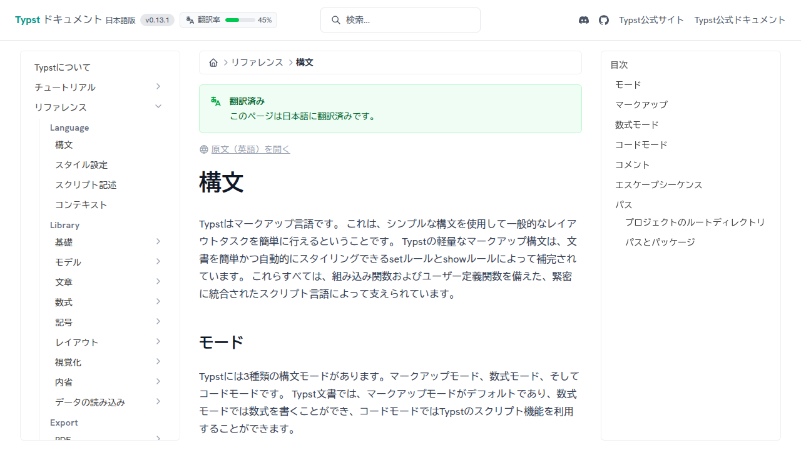

# typst-docs-web

<div align="center">
  
</div>

A generator that builds a website from a documentation JSON file generated by typst-docs.

## Commands

### Develop

> [!NOTE]
> The full-text search index is generated by [pagefind](https://pagefind.app/), but since the output directory is set to `dist/`, full-text search functionality is currently unavailable in the development server. For developing search-related features, please execute `bun run build` first, then use `bun run preview` to inspect the built output.

```sh
bun run dev
```

### Build

```sh
bun run build
```

### Preview

```sh
bun run preview
```

### Check

```sh
# Check code style
bun run check

# Apply automatic code fixes
bun run check:write
```

### Test

```sh
bun run test
```

## Maintainers

- [@3w36zj6](https://github.com/3w36zj6)

## License

This project is derived from [typst/typst](https://github.com/typst/typst) and is licensed under the Apache-2.0 license.
